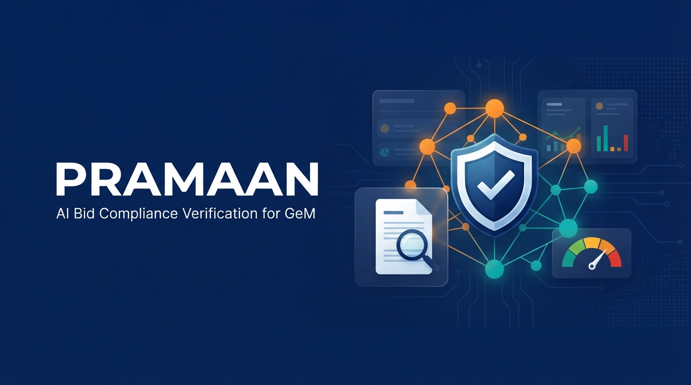

<div align="center">



# PRAMAAN

### AI Powered Integrated Bid Compliance Verification Platform for GeM Procurement

*प्रमाण (Pramaan): Sanskrit for "proof, evidence, authority".*

An AI decision support platform that verifies bidder eligibility and statutory compliance for Government e-Marketplace (GeM) procurement. It turns days of manual, multi portal document checking into minutes of explainable, auditable, evidence backed assessment. The officer always makes the final decision.


</div>

> Note: "PRAMAAN" is a working codename and can be changed. See [`docs/02-planning/vision-and-goals.md`](docs/02-planning/vision-and-goals.md).

---

## Overview

| | |
|---|---|
| **Problem Statement** | 26100 |
| **Organization** | Ministry of Petroleum and Natural Gas |
| **Department** | Chennai Petroleum Corporation Limited (CPCL) |
| **Category** | Software |
| **Theme** | Smart Automation |

**The problem.** For every bidder in every tender, a GeM procurement officer must manually cross verify more than a dozen statutory registrations (Udyam and MSME, GST with return filing, PAN and Income Tax, MCA21, Startup India, NSIC, EPFO, ESIC, DigiLocker, Make in India local content, BIS, OEM authorization, and blacklisting or debarment) across several government portals. Most of this comes from self declared, uploaded PDFs that are easy to forge and slow to check. This is the single largest bottleneck and error source in tender evaluation.

**The solution.** An AI Verification Engine ingests bidder documents and tender rules, automatically extracts and cross verifies every claim against government sources (real APIs where available, faithfully simulated where access is gated), runs a combined rules and AI compliance engine, detects document forgery and cross portal inconsistencies, and produces an explainable compliance score and risk level with a provenance stamped, printable audit report. The final qualify or disqualify decision remains with the officer; the platform is advisory.

---

## Key Capabilities

The Indian market has capable general purpose KYB and due diligence tools (Karza and Perfios, Signzy, Probe42, Tofler). None is purpose built for GeM bid eligibility. Beyond the 14 required checks, PRAMAAN adds:

| # | Capability | Value |
|---|---|---|
| 1 | Explainable compliance scoring with hard knock out vetoes and a reason breakdown | Every point traces to evidence, so officers and evaluators can trust the verdict |
| 2 | Cross portal entity resolution graph (bidder, PAN, GSTIN, CIN, DIN, address, email, phone, bank, submission IP) | Detects shell companies, related party rings, and cartels or bid rigging (the pattern behind the CCI GeM case, approximately 142 crore) |
| 3 | Document forgery and tamper detection (PDF metadata and incremental save forensics, Error Level Analysis, copy move, and LLM field cross checks) | Targets the primary fraud vector: forged uploaded certificates |
| 4 | Tender aware compliance that maps raw data to the specific tender rules (turnover, MSE and MII class, OEM and MAF, BIS) | Encodes GFR, PPP MII, and MSME procurement policy natively |
| 5 | PAN as a universal join key for reconciliation across portals | Catches the strongest automatable fraud signal: cross portal name and PAN mismatch |
| 6 | Pluggable AI and data provider layer with a live to mock toggle and offline fallback (Ollama, PaddleOCR) | Runs on free tiers and continues to work even without network access |
| 7 | Immutable, hash chained audit trail with a one click officer audit report (PDF) | Auditability and traceability aligned to government financial rules |
| 8 | Side by side bidder comparison and continuous monitoring of vendor status changes | Extends a one time check into ongoing vendor risk management |
| 9 | Authentic Government of India visual design (GeM navy `#05256E` and saffron `#F5821F`, GIGW and WCAG 2.1 AA) | Institutional trust with a modern interface |

---

## Architecture

```
Frontend (Next.js, TypeScript, Tailwind)
        |  REST / JSON (OpenAPI)
Backend (FastAPI)
   Orchestrator  ->  Compliance Engine (rules, weighted scoring, vetoes, RAG band)
                 ->  AI Engine (OCR extraction, cross check, entity graph, forgery, recommendation)
                 ->  Provider Abstraction Layer  (Live | Mock | Snapshot, with fallback chains)
   Services: hash chained audit ledger, debarment search, PDF report
        |
Data: PostgreSQL (SQLite by default for zero config) with optional pgvector
```

Design details are in [`docs/03-architecture/`](docs/03-architecture/).

## Tech Stack

| Layer | Choice |
|---|---|
| Frontend | Next.js (React, TypeScript, App Router) with Tailwind and a GeM inspired design system |
| Backend | FastAPI (Python 3.12) |
| Database | SQLite by default for zero config; PostgreSQL with pgvector documented for production |
| AI reasoning | Configurable chain: Gemini Flash, then Groq, then OpenRouter, then Ollama for offline fallback |
| AI OCR and extraction | Gemini Vision, then PaddleOCR (local, Indic scripts, tables, seals), then Google Document AI |
| Embeddings and RAG | bge-m3 (local, multilingual) or Gemini embeddings, with pgvector or Chroma |
| Forgery detection | PyMuPDF and pikepdf metadata, Error Level Analysis, and copy move (TruFor optional with GPU) |
| Government data | Real via aggregator sandboxes (Sandbox.co.in and Cashfree) for GST, PAN, MCA, DigiLocker, and Udyam; mock for EPFO, ESIC, NSIC, BIS, Startup, and GeM; scraped snapshot for debarment (World Bank and CPPP) |

> Empty key rule: the entire platform runs end to end with an empty `.env`. Every provider falls back to a deterministic mock or offline implementation when its key is missing, and upgrades to live automatically when a key is present.

---

## Getting Started

The platform runs end to end with an empty `.env`. No secrets are required.

**Option A, Docker (single command):**
```bash
docker compose -f infra/docker/docker-compose.yml up --build
# web:  http://localhost:3000
# api:  http://localhost:8000/docs
```

**Option B, local:**
```bash
# Backend
cd backend && python -m venv .venv && . .venv/bin/activate && pip install -r requirements.txt
python -m app.seed --reset          # seed deterministic synthetic bidders and tenders
uvicorn app.main:app --reload       # http://localhost:8000 (Swagger at /docs)

# Frontend (in a second terminal)
cd frontend && npm install && npm run dev   # http://localhost:3000
```

Demo login: `officer@pramaan.gov.in` / `pramaan123` (also `analyst@`, `auditor@`, `admin@`).

To enable live verification later, add keys to a root `.env` (see `.env.example`), for example `GEMINI_API_KEY`, `GROQ_API_KEY`, and `SANDBOX_KEY` with `SANDBOX_SECRET`. Any missing key falls back to the mock provider automatically.

---

## Repository Structure

```
gem-sih/
├── README.md
├── AGENTS.md                 project memory, locked decisions, conventions
├── docs/                     research, planning, architecture, design, data, demo
│   ├── 00-problem-statement/
│   ├── 01-research/
│   ├── 02-planning/
│   ├── 03-architecture/
│   ├── 04-design/
│   ├── 05-data/
│   └── 06-demo/
├── frontend/                 Next.js dashboard (11 screens, design system)
├── backend/                  FastAPI service
│   └── app/{api,core,compliance,ai,providers,models,schemas,services}
├── data/                     generators, fixtures, blacklist snapshots
├── infra/docker/             Dockerfiles and compose
└── scripts/                  dev and seed helpers
```

## Documentation

1. [`docs/README.md`](docs/README.md): documentation index
2. [`AGENTS.md`](AGENTS.md): locked decisions and conventions (read before contributing)
3. [`docs/00-problem-statement/problem-statement.md`](docs/00-problem-statement/problem-statement.md): problem statement and analysis
4. [`docs/03-architecture/system-architecture.md`](docs/03-architecture/system-architecture.md): how the system fits together

---

## Status

Full stack build complete. The platform runs end to end with an empty `.env`.

| Layer | State |
|---|---|
| Backend (FastAPI) | Foundation, 18 check compliance and AI engine, provider layer (mock, live, snapshot), hash chained audit, REST API |
| Data | Deterministic 9 bidder fraud cast and 3 tenders; golden outcomes verified end to end |
| Frontend (Next.js) | 11 screens and about 35 components; production build passes; live API with demo fallback |
| Infra | docker compose and dev scripts |

Verified golden outcomes: B1 low risk; B2 and B8 medium; B3 (forgery and OEM), B4 (PAN mismatch and cancelled GST), B5 (shell company), B6 and B7 (cartel), and B9 (debarment) all high risk. Audit chain integrity verified.

See the full plan in [`docs/02-planning/roadmap.md`](docs/02-planning/roadmap.md).

---

## Expected Impact

Per the problem statement: a 60 to 80 percent reduction in verification effort, faster tender evaluation and award, improved compliance and transparency, fewer human errors and inconsistencies, better bidder screening and risk identification, standardized verification across public sector enterprises, and complete auditability and traceability.

## Disclaimer

This is a hackathon prototype and is not an official Government of India system. It does not use the State Emblem of India. All bidder and tender data in the repository is synthetic. Government verification data is real where accessible through regulated aggregators and clearly labeled as simulated or snapshot where programmatic access is not available.
